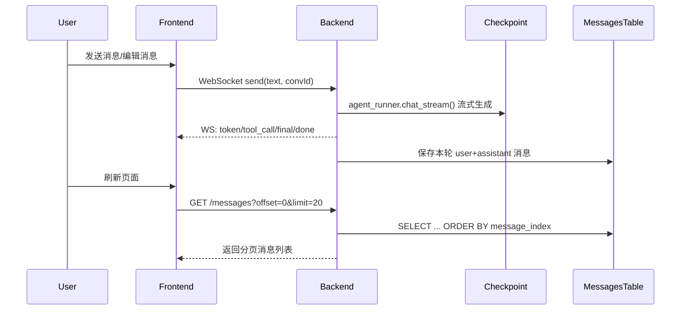

## 用户需求

实现 DeepSeek Chat 风格的消息编辑逻辑，核心要求：

### 编辑行为（对齐 DeepSeek Chat）
- 编辑一条非最新消息时，该消息之后的所有消息（包括后续的 Q&A 对）都应被**截断删除**，然后在这个位置重新生成回复
- 例如：Q1 → A1 → Q2 → A2，编辑 Q1 为 Q1' → 系统删除 Q2 和 A2，生成 A1'（仅保留 Q1'+A1'）

### 版本历史持久化
- 编辑后的版本历史（如 Q1 有 v1"你是谁"+A1 和 v2"天气如何"+A1'）通过箭头 `< 1/2 >` 切换查看
- 刷新页面或退出重新登录后，版本历史仍需保持，不能丢失
- **明确要求**：不要只用前端 localStorage 解决，需要后端提供 API 分页和历史记录

### Bug 修复
- 当 agent 正在回复第 2/2 条消息时，用户点击箭头查看第 1/2 条消息的历史版本，系统不应该在第 1 条处重新生成回复，而应继续在第 2 条处生成


## 技术栈
- 后端：Python 3.14 + FastAPI + SQLAlchemy (async) + PostgreSQL + LangGraph
- 前端：Vue 3 + Pinia + WebSocket

## 实现方案

### 核心思路

当前消息存储依赖 LangGraph checkpoint（不透明的 JSONB），没有独立的消息表，导致无法高效分页、无法精细控制版本。解决方案：新增 `messages` 表作为**权威消息存储**，checkpoint 保持不变作为 LangGraph 内部状态（Agent 推理时仍需）。后端在每轮对话完成后将消息写入 messages 表，前端从 messages 表拉取历史。



### 数据库设计

新增 `messages` 表，字段设计：

| 字段 | 类型 | 说明 |
|------|------|------|
| id | SERIAL PK | 自增主键 |
| conversation_id | VARCHAR(36) | 会话 ID |
| role | VARCHAR(10) | user / assistant |
| content | TEXT | 消息文本 |
| message_index | INTEGER | 在会话中的位置（0, 1, 2...） |
| edit_version | INTEGER DEFAULT 0 | 编辑版本号（0=原始, 1=第一次编辑） |
| is_active | BOOLEAN DEFAULT TRUE | 是否当前活跃版本（编辑后旧版本置 FALSE） |
| created_at | TIMESTAMP | 创建时间 |

**复合索引**：`(conversation_id, message_index, edit_version)` 和 `(conversation_id, is_active, message_index)`

### 编辑逻辑

编辑消息 `message_index=N` 时：
1. `UPDATE messages SET is_active=FALSE WHERE conversation_id=X AND message_index >= N` — 截断该位置及之后的所有消息
2. `INSERT INTO messages (conversation_id, role='user', content='新内容', message_index=N, edit_version=prev_version+1, is_active=TRUE)` — 插入编辑后的用户消息
3. 前端发送到 WebSocket，后端生成新回复后 `INSERT` assistant 消息到 `message_index=N+1`

版本切换：前端调用 `GET /conversations/{id}/messages/versions?message_index=N` 获取该位置的所有 edit_version，切换时 `switchVersion` 仅更新视图，不触发网络请求。

### API 设计

**1. 分页获取消息**
```
GET /api/conversations/{id}/messages?offset=0&limit=20
Response: {
  messages: [{id, role, content, message_index, edit_version, created_at}],
  total: 150,
  offset: 0,
  limit: 20,
  has_more: true
}
```

**2. 编辑触发截断**
```
POST /api/conversations/{id}/messages/edit
Body: { message_index: 3, new_content: "天气如何" }
Effect: 截断 message_index>=3 的消息，创建新版本 user 消息，返回新版本 edit_version
Response: { edit_version: 2, message_id: 42 }
```

**3. 获取某位置的版本历史**
```
GET /api/conversations/{id}/messages/versions?message_index=3
Response: {
  versions: [
    { edit_version: 0, content: "你是谁", reply: {...} },
    { edit_version: 1, content: "天气如何", reply: {...} }
  ]
}
```

**会话列表保持不变**：`GET /api/conversations` 和 `POST /api/conversations` 逻辑不变。

### 前端改造要点

- **移除 localStorage 版本管理**：删除 `_messageMetaCache`、`_saveMessageMeta()`、`_restoreMessageMeta()` 及相关去重逻辑
- **分页加载**：`fetchHistory(id, offset)` 支持增量加载，初始 offset=0, limit=20；滚动到底部时 `loadMore()` 追加
- **`sendEdit()` 改造**：编辑时先 `POST /messages/edit` 触发后端截断 → 成功后再 `resendMessage()` 发送到 WebSocket
- **`switchVersion()` 加防护**：确保只修改视图状态，不触发任何网络请求；若当前正在流式输出（`isStreaming=true`），箭头切换完全不影响 `pendingIndex`

### 性能考虑
- messages 表按 `(conversation_id, is_active, message_index)` 复合索引，单次分页查询 O(log N + limit)
- 截断操作用 `UPDATE ... SET is_active=FALSE WHERE message_index >= N`，单 SQL 完成，无需逐条删除
- 前端首次加载仅 20 条消息，长会话滚动加载更多，避免一次性拉取全量

## 目录结构

```
xiaoshutong/
├── schema.sql                          # [MODIFY] 新增 messages 表 DDL
├── config.py                           # [MODIFY] 新增 MESSAGE_PAGE_SIZE 配置
├── infra/
│   ├── db.py                           # [MODIFY] 新增 Message ORM 模型
│   └── schemas.py                      # [MODIFY] 新增 EditRequest、PaginatedMessagesResponse 等 pydantic schema
├── api/
│   ├── routes_conversation.py          # [MODIFY] 新增分页/编辑/版本历史 API；改造原有 GET messages
│   └── routes_chat.py                  # [MODIFY] chat 完成后写入 messages 表（非流式）
├── main.py                             # [MODIFY] WebSocket chat 完成后写入 messages 表
├── frontend/src/
│   ├── stores/
│   │   └── chat.js                     # [MODIFY] 移除 localStorage 版本管理；改造 fetchHistory 支持分页；新增 loadMoreMessages；同步 edit 流程
│   ├── views/
│   │   └── ChatView.vue                # [MODIFY] sendEdit 调用截断 API；switchVersion 纯只读防干扰；新增滚动加载更多
│   └── api/
│       └── client.js                   # [MODIFY] 新增 getMessages、editMessage、getVersions API 方法
```

## 关键代码结构

### Message ORM 模型 (infra/db.py)
```python
class Message(Base):
    __tablename__ = "messages"
    id = Column(Integer, primary_key=True, autoincrement=True)
    conversation_id = Column(String(36), index=True, nullable=False)
    role = Column(String(10), nullable=False)          # 'user' | 'assistant'
    content = Column(Text, nullable=False)
    message_index = Column(Integer, nullable=False)     # 会话中的位置
    edit_version = Column(Integer, default=0)           # 0=原始
    is_active = Column(Boolean, default=True)           # FALSE=被编辑截断
    created_at = Column(DateTime, default=_utcnow)
```

### 新增 Pydantic Schema (infra/schemas.py)
```python
class EditMessageRequest(BaseModel):
    message_index: int
    new_content: str = Field(max_length=8000)

class PaginatedMessagesResponse(BaseModel):
    messages: list[dict]
    total: int
    offset: int
    limit: int
    has_more: bool
```

