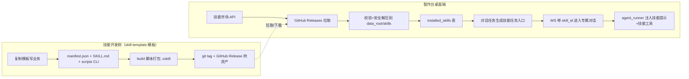

## 产品概述
将 xiaoshutong_jc 从"单体本地 AI 助手"改造为全新的技能平台型 macOS 桌面应用「智作台」（AI Workbench，标识 ai-workbench）。应用定位为「本地 Agent 工作台 + 技能市场」：开发者用 skill-template 模板写好新技能 → 打包发布到 GitHub Release → 智作台技能市场拉取安装 → 用户的对话任务里即出现该技能的专属 Agent。整套改造按企业级生产标准落地，本期仅 macOS 桌面端。

## 核心功能
- **品牌替换**：界面、窗口、包标识、文档统一为「智作台 AI Workbench」；不叫"匠厂"。
- **移除知识库**：删除前后端全部知识库相关功能（KB 注册/索引/检索/校准、RAG 工具、KB 配置表、.enc 密文上传与相关隐私方案）。
- **移除自动邮件**：删除邮件路由、SMTP 发信工具、邮箱凭证存储与前端入口。
- **保留不变**：注册登录（JWT 双 token、用户体系）、对话任务核心（WebSocket 流式聊天、消息持久化、ReAct Agent、长期记忆）。
- **技能市场（GitHub Release 分发）**：技能源=配置化 GitHub 仓库；后端拉取 releases 与 .xskill 资产；市场页支持搜索、分类、技能卡片（图标/名称/版本/描述/安装次数/安装按钮）、安装/卸载/升级。
- **技能打包链路**：技能=标准目录仓库（manifest.json 权威 + 兼容 SKILL.md frontmatter + 可选自带 CLI 脚本）；build 脚本打成 .xskill（zip 单文件，含校验）；README 与开发文档给出"复制 skill-template → 写业务 → 打包 → git tag → GitHub Release → 市场安装"完整操作说明。
- **技能 Agent 落地**：安装技能后对话任务列表新增该技能任务入口；点击进入专属对话，对话注入技能系统提示；技能自带 CLI 经安全子进程暴露为可执行工具，由主 Agent 调度；通用对话保留内置工具。
- **类匠厂 UI**：左侧一级边栏（对话任务/技能市场/数据管理/任务中心/定时任务/模型管理/频道管理/插件管理/更多/系统设置）；对话任务=任务列表+聊天区；其他模块先占位。
- **版本更新**：远端更新 manifest；有新版本启动弹窗提示；系统设置-更新面板可手动检查、查看版本信息并下载；预留自动检查开关。


## 技术栈
- 桌面壳：Tauri v2（Rust，macOS）
- 前端：Vue 3 + Vue Router + Pinia + Axios + tdesign-vue-next（企业级组件库）
- 后端：Python FastAPI + LangGraph（ReAct Agent）
- 存储：PostgreSQL（用户/会话/消息/技能注册表）+ Redis（必填协调：锁/信号量/限流/缓存）
- 向量：保留 Chroma 仅作长期记忆热存储（非知识库用途）
- 技能分发：GitHub Releases（公开仓免 token 匿名 API；可选 PAT 提升配额/访问私有仓）
- 技能运行时：Python 子进程隔离执行（JSON in/out、timeout、env 白名单）

## 架构设计
### 技能生命周期（核心链路）

- **技能包契约 XST-Skill v1**：仓库根 `manifest.json` 为权威元数据（schema_version/slug/name/version/description/author/emoji/category/runtime{type,entry,cli,env_whitelist}/system_prompt_file/permissions/min_app_version）；解析层对缺失 manifest 的技能兼容回退读取 `SKILL.md` frontmatter（slug/name/description/version/emoji/category/author），从而直接复用 skill-template 产出的仓库。
- **打包产物 .xskill**：zip 单文件（内含技能目录 + manifest.json + 校验信息），命名 `skill-<slug>-<version>.xskill`，作为 GitHub release asset。
- **多实例一致性**：技能列表走 Redis/本地 TTL 缓存（规避 GitHub 匿名 60 次/小时限流）；技能 CLI 子进程执行受 Redis 分布式信号量限流（复用 state_store 模式），多副本不放大并发。
- **爆炸半径控制**：单个技能加载/执行失败仅影响该技能（安装标记 failed、从工具链剔除、对话回退通用 Agent），不影响平台整体；GitHub 拉取失败有缓存与重试。

### 关键安全设计（企业级）
- 解压防目录穿越（zip-slip）：逐条校验目标路径规范化后必须位于技能根目录内。
- manifest 经 JSON Schema 严格校验后才落盘/登记。
- 技能 CLI 子进程：超时上限、独立 cwd（技能目录）、env 白名单注入、敏感凭据经 `XST_SKILL_SECRET_*` 环境变量注入（不进 stdin/日志）；失败返回结构化错误。
- 路径全部基于 data_root 规范化；技能市场接口沿用 JWT 鉴权与现有审计中间件。

### 改造目标（按模块）
- **删除**：api/routes_kb.py、api/routes_email.py；core/kb_manager.py、core/kb_calibration.py；tools/rag_tool.py、tools/email_smtp_tool.py、tools/kb_crypto.py；schema/db 中 KB/邮件相关表（user_kb_config、calibration_tasks、user_email_creds 等，精确清单以 code-explorer 扫描为准）；main.py 中对应路由注册与 kb_manager.set_tenant 调用；前端 KBView.vue、KBListPage.vue、components/KBItem.vue、/kb /kb-list 路由及 KB 相关 api/store。
- **保留**：auth/session/chat/messages 路由、agent.py、agent_runner.py、memory/long_term.py、state_store.py、security.py、observability、tools/{web_search,memory_tool,calc_tool,time_tool,local_tool}.py（本地控制工具按技能白名单注入）。
- **新增（后端）**：skills/ 包（manifest_schema.py、catalog.py 技能源与 GitHub 拉取、installer.py 校验解压落盘、runtime.py 子进程执行器）、api/routes_skills.py、api/routes_update.py。
- **新增（数据）**：skills（市场快照）、skill_sources（配置化 GitHub 源）、installed_skills（用户安装记录）；conversations 加 skill_id 列。
- **Agent 集成**：agent_runner.chat_stream 增加 skill_id；WS 消息协议带 skill_id；conversation 按 (user, skill_id) 自动创建/复用；对话任务入口=「新建任务(通用)」+ 每已装技能一张任务卡片。

## 目录结构
```text
xiaoshutong_jc/
├── skills/                                # [NEW] 技能平台核心（后端 Python 包）
│   ├── manifest_schema.py                 # XST-Skill manifest JSON Schema + SKILL.md frontmatter 兼容读取
│   ├── catalog.py                         # 技能源/GitHub Releases 拉取 + TTL 缓存
│   ├── installer.py                       # .xskill 下载/校验/防穿越解压/落盘/卸载/升级
│   └── runtime.py                         # 技能 CLI 子进程执行器（超时/env 白名单/结构化错误）
├── scripts/
│   ├── build_skill.py                     # [NEW] 技能打包 CLI（目录→.xskill）
│   └── release_skill.sh                   # [NEW] 打包+git tag+gh release 发布辅助脚本
├── data/skills/                           # [NEW] 技能安装根目录（data_root 下）
│   └── _examples/web-search/              # [NEW] 示例技能仓库（演示链路，含 manifest.json）
├── api/
│   ├── routes_skills.py                   # [NEW] 市场 list/search/install/uninstall/upgrade/my
│   ├── routes_update.py                   # [NEW] 版本信息接口
│   ├── routes_kb.py                       # [DELETE]
│   └── routes_email.py                    # [DELETE]
├── core/agent_runner.py                   # [MODIFY] skill_id 注入提示词 + 动态合并技能工具
├── main.py                                # [MODIFY] 路由注册/WS 协议/删 KB 调用
├── infra/db.py 与 schema.sql              # [MODIFY] 删 KB/邮件表，加 skills/skill_sources/installed_skills、conversations.skill_id
├── frontend/src/
│   ├── App.vue                            # [MODIFY] 左侧一级边栏全局布局
│   ├── router/index.js                    # [MODIFY] 路由重构（/tasks /market /settings /placeholder/:key）
│   ├── views/ChatView.vue                 # [MODIFY] 对话任务（任务列表+聊天区）
│   ├── views/SkillMarketView.vue          # [NEW] 技能市场
│   ├── views/SettingsView.vue             # [NEW] 系统设置（更新面板）
│   ├── views/PlaceholderView.vue          # [NEW] 占位模块
│   ├── components/AppSidebar.vue          # [NEW] 左侧边栏
│   ├── components/SkillCard.vue           # [NEW] 技能卡片
│   ├── components/TaskCard.vue            # [NEW] 任务入口卡片
│   ├── stores/skills.js                   # [NEW]
│   ├── api/skills.js                      # [NEW]
│   └── api/update.js                      # [NEW]
├── src-tauri/
│   ├── tauri.conf.json                    # [MODIFY] productName/title/identifier=ai-workbench/version、updater
│   ├── Cargo.toml                         # [MODIFY] tauri-plugin-updater（如需自动安装）
│   └── src/lib.rs                         # [MODIFY] 版本检查/下载命令与启动检查
├── config.py                              # [MODIFY] 新增 SKILL_SOURCES/SKILLS_ROOT/GH_TOKEN/UPDATE_MANIFEST_URL
├── docs/skill-development.md              # [NEW] 技能开发与发布操作手册
└── README.md                              # [MODIFY] 智作台品牌与功能说明
```

## 关键代码结构
技能 manifest（技能仓库根，权威元数据；缺失时回退 SKILL.md frontmatter）：
```json
{
  "schema_version": 1,
  "slug": "web-search",
  "name": "联网搜索",
  "version": "1.0.0",
  "description": "使用 SerpAPI 搜索互联网获取最新信息",
  "author": "your-name",
  "emoji": "🔍",
  "category": "工具",
  "runtime": { "type": "python", "entry": "scripts/main.py", "cli": "run", "env_whitelist": ["SERPAPI_API_KEY"] },
  "system_prompt_file": "AGENT.md",
  "permissions": ["network"],
  "min_app_version": "0.1.0"
}
```
技能 CLI 契约：平台以 `python <entry> <cli>` 调用，参数 JSON 走 stdin、结果 JSON 走 stdout；非零退出码 + stderr 摘要为错误；敏感参数由平台经环境变量注入。

Agent 集成签名（沿用现有 agent_runner 风格，执行期以实际代码为准）：
```python
async def chat_stream(user_id, thread_id, message, user_name="", history=None, skill_id=None):
    # 加载已安装技能 manifest → 追加 system prompt → 工具集 = 通用工具 + 技能 CLI 包装的 @tool
```

WS 消息扩展：前端上行消息增加 `skill_id` 字段，后端透传 agent_runner；conversation 查询按 (user_id, skill_id) 自动创建或复用。


## 设计总览
采用 tdesign-vue-next 企业级组件库统一按钮/输入框/开关/弹窗/卡片控件，浅色桌面工作台风格，视觉基调贴近参考截图（匠厂 App）：左侧一级导航 + 右侧内容区 + 卡片式列表 + 蓝色主行动色 + 圆角与柔和阴影，配合克制的微交互动效，观感专业、清爽、有生产力工具气质。

## 页面规划
### 1. 全局布局 App.vue
左侧固定宽度边栏（约 200px，可折叠为 64px 图标栏），顶部品牌区（图标 + 「智作台」）；一级菜单 10 项：对话任务、技能市场、数据管理、任务中心、定时任务、模型管理、频道管理、插件管理、更多、系统设置；选中项主色高亮圆角背景，hover 有轻微背景过渡；底部显示版本徽标。右侧主内容区随路由切换，浅灰背景 #F5F6F8。

### 2. 对话任务模块 ChatView.vue
两栏：左侧任务面板（顶部搜索框 + 「新建任务」主按钮 + 任务卡片列表：图标、技能名、slug、当前会话摘要）；「新建任务」为首个高亮卡片，其余为已安装技能对应的技能任务卡片；右侧聊天区顶部为当前任务标题，中间为消息流，底部为输入区与模型选择（DeepSeek）；空态展示引导文案。

### 3. 技能市场模块 SkillMarketView.vue
顶部标题 + 副标题；搜索输入框 + 「搜索」按钮；分类标签行（全部 + 动态分类）；技能卡片网格/列表：左侧圆角图标（emoji 或图片），右侧名称、版本与价格/授权标识、描述、安装次数；卡片右上/右下安装按钮，已安装态切换为「打开」「升级」「卸载」；安装中按钮 loading。

### 4. 系统设置模块 SettingsView.vue
左侧二级设置菜单（用户信息/存储管理/通用/更新/关于等）；更新面板展示当前版本、可用新版本卡片（版本号+更新说明）、「检查更新」「下载更新」按钮与「自动检查更新」「自动更新」开关；发现新版本时 tdesign Dialog 弹窗（标题"发现新版本"，含更新日志与「立即下载/稍后」）。

### 5. 占位模块 PlaceholderView.vue
数据管理/任务中心/定时任务/模型管理/频道管理/插件管理/更多 复用同一占位页：中央大图标 + 模块名 + 「功能开发中，敬请期待」。

## 交互与动效
菜单切换、卡片 hover 上浮 + 阴影加深；按钮/开关含焦点态与键盘可达；技能安装状态变化以轻量动画反馈；弹窗/空态/加载态统一 tdesign 规范。

## Agent 扩展
### SubAgent
- **code-explorer**
  - 用途：动手前全库扫描 kb/email 全部引用点、agent 工具注册链（_get_tools 等）、WS 消息字段、db 模型与迁移、数据目录约定、Tauri 配置与品牌字面量（xiaoshutong/XST），输出精确的删除与替换清单，防止残留引用导致启动失败。
  - 预期结果：产出待删除文件/待改行清单与调用链图，支撑 remove-kb-email 与 rename-brand 两阶段零遗漏执行。
### Skill
- **lsp-code-analysis**
  - 用途：语义分析 Agent 工具注册与调用链、WS 会话协议字段、db ORM 模型依赖关系，确认 agent_runner 技能注入与动态技能工具合并的精确改造接口。
  - 预期结果：明确 skill_id 透传点、技能工具包装方式、conversations.skill_id 影响面，避免遗漏调用方。
