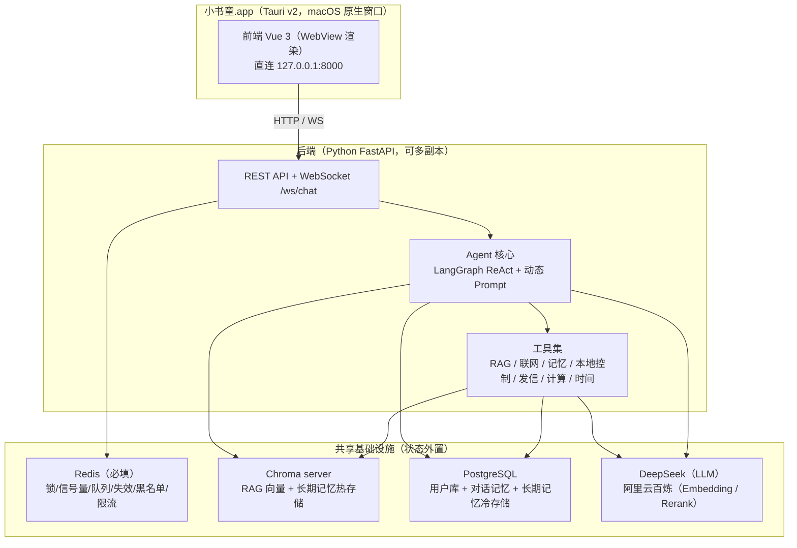
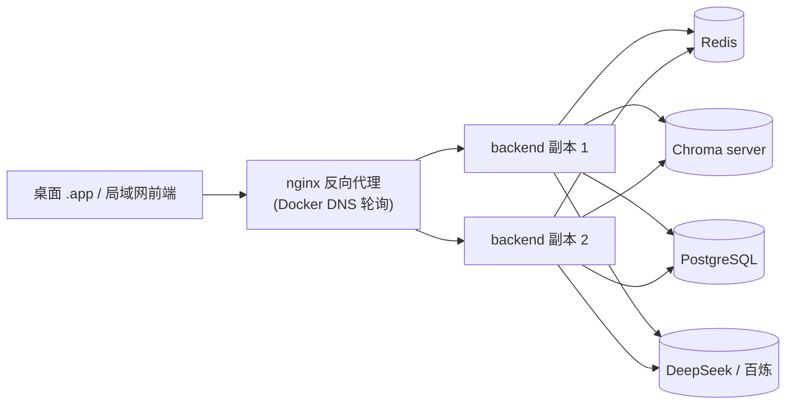
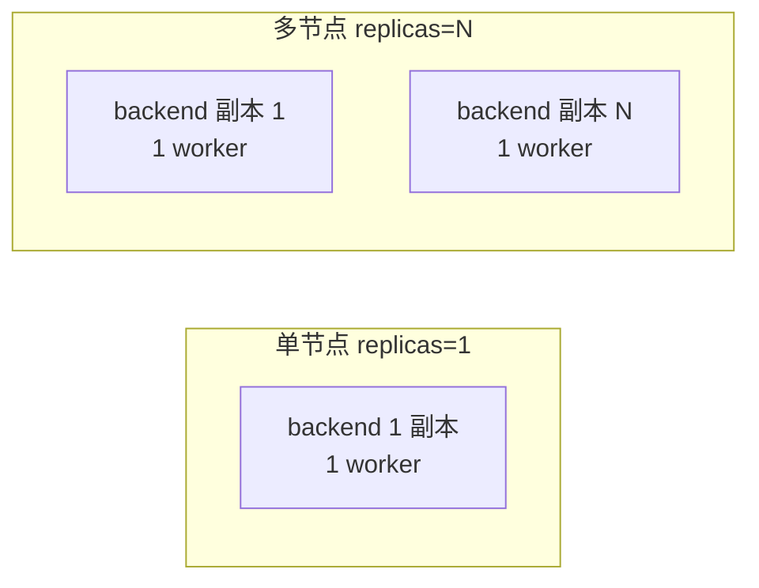

# 小书童（XiaoShuTong）项目面试技术文档

> 本文档面向**技术面试**，系统介绍「小书童」项目的架构、技术栈、Agent 模块技术点（及选型理由）、后端多并发设计与运维配合方案。适合后端 / Agent 开发岗位候选人在面试中讲解与准备追问。

---

## 一、项目概述

**小书童**是一个**跑在用户本机的 macOS 桌面 AI 助手**。它不是网页 SaaS，而是一个原生 `.app` 窗口：前端用 Vue（Tauri WebView 渲染），后端是 Python（FastAPI + LangGraph），**两者都在用户本机运行**。因此 Agent 不仅能聊天、查知识库、联网，还能**真正操控这台 Mac**（打开应用、打开网页、执行 AppleScript），并能**通过 163 SMTP 直发邮件（含附件）**。

同时，后端也**支持作为独立服务容器化部署**（Docker + Redis + Chroma server，可多实例横向扩展），作为桌面 `.app` 的集中后端或局域网共享后端。

### 1.1 核心能力

| 能力 | 说明 |
|------|------|
| 注册 / 登录 | 本机账号体系，数据隔离（JWT 双 token + bcrypt） |
| 知识库问答 | 本地文档向量检索 RAG（混合召回 + rerank） |
| 联网搜索 | 实时信息（SerpAPI） |
| 长期记忆 | 跨会话记住偏好 / 事实（热向量 + 冷 BM25 双层） |
| 操控本机 | 打开应用 / 打开网页 / AppleScript 自动化（仅 macOS） |
| 163 邮箱发信 | 纯文本 + 任意附件，统一走 SMTP 直发 |

### 1.2 目标人群

- 需要「个人知识管理 + 本机自动化」的 Mac 用户；
- 想用自然语言让电脑帮忙发邮件、整理资料、查信息的个人 / 小团队；
- 对**数据隐私敏感**、希望 AI 运行在自己机器上而非云端 SaaS 的用户。

### 1.3 一句话定位（面试可脱口而出）

> 一个**本地优先（local-first）**的 Agent 桌面应用：用 LangGraph 编排 ReAct 推理，用 LlamaIndex + Chroma 做 RAG，用 FastAPI + Redis 做无状态多实例后端，桌面壳用 Tauri 把前后端打包成一个 macOS `.app`，既能聊天问答又能真操控本机。

---

## 二、整体架构

### 2.1 分层架构图



### 2.2 生产部署拓扑（多实例）



**关键设计原则**：后端**无状态化**，所有协调态（锁、信号量、队列、缓存失效、token 黑名单、限流计数）全部外置到 Redis；向量与记忆外置到 Chroma / PostgreSQL。因此**代码没有「单实例 / 多实例」分叉**，横向扩容只取决于 `backend.replicas` 副本数。

### 2.3 一次聊天请求的完整链路（面试常问）

1. 前端（Vue）通过 **WebSocket** `/ws/chat` 连接到 nginx，nginx 经 Docker 内置 DNS 轮询转发到某个 backend 副本。
2. 后端 `main.py` 的 WS 入口做 **token 鉴权**（`decode_access_token`），按 `user_id` 做**应用层限流**（`rate_allow` 走 Redis）。
3. 每条用户消息启动一个**独立的 asyncio task**（`_run_chat`），互不取消；用 `get_lock(f"run:{thread_id}")` 串行化同一段对话的运行。
4. task 从业务消息表读取本轮上下文（`get_context_messages`），调用 `agent_runner.chat_stream`。
5. `agent_runner.chat_stream` 用 `init_run_agent()` 拿到编译好的无状态 LangGraph Agent，注入 `user_id`（用于记忆隔离与画像），以 `stream_mode=["messages","values"]` 流式运行 ReAct 循环。
6. 每轮 LLM 调用前，`dynamic_prompt` 回调动态注入「已知用户画像」（来自长期记忆检索），不污染短期记忆。
7. Agent 在循环中**决策 → 调用工具 → 回收结果**，工具包括 RAG 检索、联网、记忆、本机控制、发信等；工具运行在线程池，不阻塞事件循环。
8. 流式 token / 工具调用 / 工具结果实时经 WebSocket 推回前端；检测到重复工具调用（防循环）则中断。
9. 整体有 `chat_timeout_seconds` 超时兜底；运行结束后把 user / assistant 消息持久化到 PostgreSQL。

### 2.4 隔离设计（多用户 / 多会话天然不串号）

- **短期记忆**：`thread_id = "{user_id}:{conversation_id}:{segment}"`，按用户 + 会话 + 段隔离。
- **长期记忆**：经 `RunnableConfig["configurable"]["user_id"]` 注入，即使工具在异步线程池执行也能正确拿到当前用户 ID。
- **向量库**：Chroma 按租户 `kb_{user_id}` 的 tenant / database 原生隔离。
- **多实例协调**：per-tenant 锁、会话线程锁、建索引信号量、校准队列、KB 缓存失效广播均经 `state_store` 走 Redis，跨实例串行 / 共享。

---

## 三、技术栈清单

| 层 | 技术 | 说明 / 版本要点 |
|----|------|------------------|
| 桌面壳 | **Tauri v2**（Rust） | 原生 WebView 窗口 + 本机执行层（仅 macOS） |
| 前端 | **Vue 3** + Vue Router + Pinia + Axios | WebView 加载，直连 127.0.0.1:8000 |
| 后端框架 | **Python FastAPI** + uvicorn[standard] | 异步 IO，支持 WebSocket |
| 数据库驱动 | **SQLAlchemy (asyncio)** + asyncpg | 异步 ORM + PostgreSQL 连接池 |
| Agent 编排 | **LangGraph**（`create_react_agent`）+ LangChain ≥0.3 | ReAct 图、recursion_limit 防死循环 |
| 知识库 / RAG | **LlamaIndex** + **ChromaDB**（server 模式）+ jieba + rank_bm25 | 混合召回（向量 + BM25 → RRF 融合）+ rerank |
| 长期记忆 | **Chroma**（热，向量）+ **PostgreSQL**（冷，BM25） | 双层记忆，满 200 条截断摘要归档 |
| LLM | **DeepSeek**（OpenAI 兼容接口） | `deepseek-chat`，streaming |
| Embedding / Rerank | **阿里云百炼** `qwen3.7-text-embedding` / `qwen3-rerank` | RAG 与长期记忆共用 embedding |
| 协调后端 | **Redis**（必填，redis.asyncio） | 锁 / 信号量 / 队列 / 失效广播 / 黑名单 / 限流 |
| 鉴权 | **JWT 双 token**（access 15min + refresh 7d，含 `jti` 可吊销）+ **bcrypt** | 注销即时失效走黑名单 |
| 可观测 | **Prometheus** `/metrics` + **Loki** + **Promtail** + **Grafana** | 结构化 JSON 日志 + 指标 + 告警 |
| 部署 / 运维 | **Docker** + **docker-compose** + **nginx** + **GitHub Actions CI** | 多副本 backend + 独立 infra 服务 |

---

## 四、Agent 功能模块技术点与选型理由（重点）

> 本节是面试核心。每个技术点都给出「实现方式很多，为什么这样选」的回答思路。

### 4.1 ReAct 推理框架（LangGraph）

**做了什么**：用 `langgraph.prebuilt.create_react_agent` 把「思考（Reason）→ 行动（Act）→ 观察（Observe）」编排成图。Agent 先读用户消息，决定是直接回答还是调用工具；工具返回结果后再次进入 LLM，循环直到给出最终答案。`recursion_limit=12` 限制单轮工具调用深度。

**为什么选 LangGraph 而不是手写循环 / 其他框架**：
- **图即状态机**：ReAct 本质是「LLM 决策 + 工具执行」的状态机，LangGraph 用 `StateGraph` 把状态、节点、边显式建模，比手写 `while` 循环更易维护、可观测。
- **生态成熟**：与 LangChain 工具 / 消息类型无缝对接，工具就是普通 Python 函数。
- **循环保护**：`recursion_limit` + 应用层「连续 3 次重复工具调用即判 loop_detected 中断」（见 `chat_stream`），避免 Agent 陷入无效死循环——这是手写循环容易忽略的健壮性点。

> 说明：本项目线上对话**不使用** LangGraph checkpointer。每轮完整上下文由调用方从业务 `messages` 表（`get_context_messages`）显式读取后传入，Agent 不读写共享 thread，天然避免并发覆盖。短期记忆的持久化与恢复由业务表 + 历史回传自行负责。

> 面试追问：为什么用 `create_react_agent` 预置图而不是自己 `StateGraph`？——预置图覆盖了 99% 的对话场景，省代码；需要自定义分支时仍可基于底层 API 扩展。当前选择是「够用且规范」。

### 4.2 Function Calling 工具调用

**做了什么**：工具以普通 Python 函数注册（`_get_tools()`），包括 `search_knowledge_base`（知识库）、`web_search`（联网）、`save_to_memory` / `recall_from_memory`（记忆）、`open_application` / `open_webpage` / `run_apple_script`（本机控制）、`send_email_smtp` / `check_email_ready`（发信）、`calculator` / `get_current_time`。工具本身**无单次问答状态**，可被并发复用。

**为什么这样选**：
- **LLM 原生能力**：DeepSeek 支持 OpenAI 兼容的 function calling，让模型自己决定何时调用哪个工具、填什么参数，比「关键词路由」更自然、更泛化。
- **工具与推理解耦**：新增能力只需加一个函数 + 改 prompt 工具清单，不改推理框架。
- **本机控制的安全性**：本机动作（打开应用 / AppleScript）是「真实副作用」，因此前置 TCC 授权 + 工具层「谎报成功护栏」（见 4.7）兜底。

### 4.3 混合 RAG（向量 + BM25 + RRF，零知识）

**做了什么**（对应 README 第十节）：知识库检索走「向量召回（top_k）+ BM25 关键词召回（jieba 分词）→ RRF 融合 → 相似度阈值过滤」，命中片段回用户目录按偏移取原文返回。Chroma 里 `store_text=False`，**只存向量 + 定位 metadata（rel_path / 字符偏移），绝不持久化原文**。

**为什么这样选（对比纯向量 / 纯 BM25）**：

| 方式 | 擅长 | 短板 |
|------|------|------|
| 向量检索 | 语义匹配（"怎么退课" 命中 "课程取消流程"） | 专名 / 编号 / 代码易被切坏而 miss |
| BM25 / 词法 | 字面强匹配（"订单号 A2026" 一击即中），便宜、确定、可解释 | 不懂语义 |
| **混合（本项目）** | 二者互补，RRF 融合取长 | 实现稍复杂 |

> **选型理由**：纯向量对专名 / 编号召回差；纯 BM25 不懂语义。工业界主流（LangChain `EnsembleRetriever`、Haystack、Vespa）都是混合。本项目用 RRF（Reciprocal Rank Fusion）融合两路排序，无需训练权重，简单稳健。

**「零知识」设计（隐私卖点）**：`store_text=False` 让运营方只持有向量 + 定位元数据，取不回原文——即便向量库被攻破也拿不到用户文档明文。检索时回用户 `doc_dir` 按字符偏移实时取原文。

**为什么「只检索不合成」**：`Settings.llm = None` 关闭 LlamaIndex 的 LLM 合成，检索结果原样返回，最终归纳交给主 Agent（DeepSeek）。避免 LlamaIndex 在合成阶段偷偷回退到默认 OpenAI LLM 导致 401，也让 Agent 的推理能力统一掌控答案组织。

**切分与调参（体现工程深度）**：默认 `SentenceSplitter(chunk_size=512, overlap=64)`，可选叠加 `SemanticSplitterNodeParser` 做语义切分兜底。`top_k` / `similarity_threshold` / `max_return_chunks` 集中到 `RAG_CONFIG_DEFAULTS`，支持由 `user_kb_config` 逐库覆盖；并有**在线自动校准**（`kb_calibration`）用真实文件扫 `(top_k, threshold)` 网格择优回写。

> 面试追问：为什么切块大小要显式调而不是用底层默认？——底层默认（LlamaIndex 默认 top_k=2、chunk 可能过大）往往不适合你的文档与 query；上线前必须用 golden set 算 recall@k 选平衡点，这是「demo 变生产」的关键一步。

### 4.4 双层长期记忆（热向量 + 冷 BM25）

**做了什么**（对应 README 第十二节）：每条记忆写入时向量化存 **Chroma 热存储**（全文、可语义检索）；热存储满 `HOT_MAX_PER_THREAD=200` 条时，取最旧 `20` 条各取前 `300` 字拼接成一条摘要，写进 **PostgreSQL 冷存储**（BM25）。检索时热、冷两路并行，按 `相似度/BM25分 × 0.9^(days_ago/30)` 时间衰减合并重排取 top_k。

**为什么这样选**：
- **热存储用向量**：近期记忆要「精准语义检索」，向量召回最合适。
- **冷存储用 PostgreSQL + BM25 而非再开一个向量库**：冷记忆是「粗粒度兜底」，已截断成短摘要，关键词命中即可；BM25（jieba 中文分词）便宜、确定、可解释，且**避免了再维护一套向量索引**。旧方案用 `LIKE '%关键词%'` 有「前导通配符全表扫描 / 按空格切词对中文失效 / 无 IDF 排序差」三硬伤，改 BM25 后消除。
- **压缩 ≠ 加密**：这里「压缩」是有损的「截断 + 合并明文摘要」，原文删除不可恢复，但明文摘要仍可被 BM25 关键词搜到——所以检索不需要、也不存在「解压」。

> 面试追问：冷存储为什么不直接用向量？——量小/粗粒度场景 BM25 性价比更高；真正到百万级、含专名/编号、高并发时，应换统一混合检索引擎（Qdrant / Weaviate / Elasticsearch）。当前方案是「成本与复杂度最优」的中间态。

### 4.5 上下文分段隔离 + 动态用户画像

**做了什么**：
- 短期记忆按 `segment` 分段（每段上限 `segment_max_messages=30` 条），超则开新段；跨段连续性由长期记忆保证，避免上下文无限膨胀。
- `dynamic_prompt` 在每轮 LLM 调用前，按 `user_id` + 当前 query 检索长期记忆画像，动态追加「## 已知用户画像」到系统提示词；该画像**仅在本次 LLM 调用中使用**，不持久化到对话历史，做到「越聊越懂你」。
- 同轮内对 `(user_id, query)` 缓存画像检索结果，避免 ReAct 循环内重复检索。

**为什么这样选**：画像做成「运行时动态注入」而非「静态写死在 system prompt」，既保证个性化，又不会让历史对话越来越长、污染短期记忆；且不串号（user_id 隔离）。

### 4.6 WebSocket 流式输出

**做了什么**：聊天走 WebSocket 而非普通 HTTP，Agent 用 `agent.astream(stream_mode=["messages","values"])` 逐 token 产出，`chat_stream` 把 `AIMessageChunk` 转成 `token` / `tool_call` / `tool_result` 事件实时推给前端，实现「逐字输出 + 工具过程可见」。编辑历史消息时只取该消息之前的上下文（`before_seq`），避免带入后续消息。

**为什么选 WebSocket 而非 SSE / 轮询**：
- 双向通信：前端还能发 `cancel` 取消运行、`local_control_result` 回传本机操作结果，HTTP 轮询做不到这种交互。
- 比 SSE 多「上行通道」，契合「Agent 调用本机工具、本机再回传结果」的控制流。
- 长连接受 nginx `proxy_read_timeout 3600s` 保护，避免流式输出中途断连。

### 4.7 失败兜底与护栏（健壮性亮点）

- **整体超时**：`chat_timeout_seconds`（默认 120s）包裹整轮对话（含多轮工具调用 / 压缩），到点强制中断返回兜底提示，防止某个卡死的 LLM / 工具把 worker 连接一直占着导致雪崩。
- **LLM 重试**：`ChatOpenAI(max_retries=3, timeout=llm_request_timeout)`，API 抖动自动重试，避免输出中途断裂。
- **Embedding / Rerank 退避**：批量 embedding 调用指数退避重试（`embed_retry_base`、`rerank_max_retries`），扛百炼 429 限流。
- **谎报成功护栏**：`_guard_email_claim` / `_guard_local_open_claim`——若 Agent 文本宣称「已发送邮件 / 已打开应用」但本轮并无对应工具的成功回执（含 ✅），则纠正为诚实提示，**杜绝 Agent 幻觉式谎报副作用**。

> 这些护栏是「Agent 有真实副作用（发邮件、操控电脑）」场景下必不可少的工程细节，面试时很加分。

---

## 五、后端多并发设计（重点）

> 核心思路：**异步高并发 IO + 状态全外置 + 多副本水平扩展**，三者配合使系统可随副本数线性扩容。

### 5.1 异步框架（单副本内高并发）

- 后端用 **FastAPI + asyncio + uvicorn**，所有 IO（LLM 调用、embedding、DB、Redis、Chroma）均为 `await` 异步，单进程即可支撑大量并发连接（事件循环不阻塞）。
- Agent 的重度同步工作（建索引、校准网格扫描、记忆压缩）放到 `asyncio.to_thread` 线程池，不阻塞事件循环。
- WebSocket 每条用户消息用 `asyncio.create_task(_run_chat(...))` 启动**独立 task**，并发运行、互不取消——同一用户可连续发多条消息而不互相阻塞。

### 5.2 无状态化（状态全外置，多实例无代码分叉）

原进程内状态是单实例硬伤，现已**全部外置到 Redis**（代码落点 `infra/state_store.py`）：

| 原进程内状态 | 外置方式 | 代码 |
|--------------|----------|------|
| 会话线程锁 | `get_lock(f"run:{thread_id}")` Redis 分布式锁（SET NX + 自旋 + 自动过期） | `main.py` |
| per-tenant 建索引锁 | `get_lock(f"kb:{tenant}")` | `kb_manager.py` |
| 建索引全局信号量 | `get_semaphore("kb_build", N)` Redis 分布式信号量 | `kb_manager.py` |
| 校准全局 / 单租户信号量 | `get_semaphore("calib_global" / "calib_tenant:*", N)` | `kb_calibration.py` |
| 校准任务队列 | `get_queue()` Redis 共享队列（多副本争抢，天然负载均衡） | `kb_calibration.py` |
| KB 缓存失效 | `publish_invalidate` + `listen_invalidate`（Pub/Sub 广播） | `kb_manager.py` |
| 刷新 token 黑名单 | `revoke_token` / `is_revoked`（Redis 集合 + TTL） | `security.py` |
| WS 应用层限流 | `rate_allow`（`INCR + EXPIRE` 滑动窗口，跨副本共享计数） | `main.py` |

`state_store.py` 是统一抽象层，内部统一用 `redis.asyncio` 原语（带 TTL、Lua 原子操作、Pub/Sub），`REDIS_URL` 未配置启动即报错，**不再有进程内降级分支**——业务逻辑完全不感知后端差异。

### 5.3 多副本水平扩展（关键约束：不用多 worker）



- 横向扩容靠**多副本**（`docker compose up -d --scale backend=2`），每个容器仍 **1 个 worker**。
- **关键约束**：同一容器内**严禁 `--workers N>1`**。即便状态外置，进程内仍有少量状态（失效监听任务、worker 池），多 worker 会不一致。所以「扩并发 = 加副本，不加 worker」。

### 5.4 分布式信号量：跨副本全局上限不被副本数放大（面试高频）

这是本项目并发设计的**精髓**。以校准并发为例：

- **进程内信号量的坑**：若用 `asyncio.Semaphore`，每副本各持一份上限 → N 副本 = N×上限。2 副本下 `CALIB_MAX_WORKERS=4` 实际变成全局 8，直接打爆 embedding 配额。
- **Redis 分布式信号量（`RedisSemaphore`）**：用 Lua 原子 `incr/decr` 实现全局计数闸门，`acquire` 时实时读 `semcfg:<name>` 动态上限，达到上限则自旋等待。多副本共享同一计数 → **全局并发上限恒等于配置值**（如 4），不被副本数放大。
- **TTL 安全网**：持有者崩溃未释放时，计数键 `sem:<name>` 过 `ttl`（默认 3600s）自动过期自愈，避免槽位永久占满导致闸门卡死。
- **运维热更**：上限实际存于 `semcfg:*`，运维接口 `POST /api/admin/concurrency` 写 Redis 即时全副本生效；`ADMIN_API_TOKEN` 留空则接口 503 禁用。
- **限流感知退避**（雪崩保护）：校准 worker 检测根因为限流（429 / quota）的失败 → 自动下调全局并发上限（`calib_global` 减 1，下限 1）+ 指数退避（2s→4s→…→60s）重试；成功后再谨慎回弹（+1，天花板为配置值），避免雪崩后瞬间打爆配额。

### 5.5 多租户配额 + 应用层限流（公平与防滥用）

- **配额**：`kb_max_per_tenant` / `kb_max_docs_per_kb` / `kb_max_doc_bytes`（每租户库数 / 单库文档数 / 单库总大小），注册 / 建索引前校验，超限返回 400，防单租户膨胀影响他人。
- **限流**：HTTP 中间件（auth / api 双桶）+ WS 应用层按 `user_id` 固定窗口（`rate_allow` 走 Redis 共享计数，多实例一致）；auth 接口更严（`RATE_LIMIT_AUTH_PER_MINUTE`）防爆破。
- **校准公平调度**：全局并发上限 + 每租户并发上限（`CALIB_MAX_PER_TENANT`）双闸门，防大租户饿死小租户；校准是低频后台操作，与实时聊天检索走不同路径，排队不影响提问。

---

## 六、运维如何配合后端实现多并发（重点）

> 后端把状态外置后，运维的任务是：**提供共享基础设施、做流量入口负载、做探针与可观测、做备份与资源约束**。二者配合才能「加副本即扩容」。

### 6.1 nginx：多副本流量入口（Docker DNS 轮询）

```nginx
resolver 127.0.0.11 valid=10s ipv6=off;     # Docker 内置 DNS
upstream backend {
    zone backend 64k;
    server backend:8000 resolve;            # 轮询分发到所有副本
}
```

- 前端统一连 `127.0.0.1:8000`，nginx 转发到 backend 池。
- **扩容即生效**：`docker compose up -d --scale backend=2` 后，Docker DNS 对 `backend` 服务名返回全部副本 IP，nginx `resolve` 每 10s 刷新副本列表，**无需改配置、无需重启 nginx** 即可把流量分摊到新副本。
- WebSocket 支持：`proxy_set_header Upgrade/Connection "upgrade"` + `proxy_read_timeout 3600s`，保证流式聊天不断连。
- 后端不再直接暴露端口，统一由 nginx 反向代理，避免多副本端口冲突。

### 6.2 探针策略（liveness / readiness 分离，防雪崩）

- **liveness = `/healthz`**：仅校验「进程存活 + DB 可达」。DB 是硬依赖，挂了重启才有意义，故交给 docker 当重启探针。
- **readiness = `/readyz`**：校验「DB + Redis」。但**不**交给 docker 当探针——Redis 属软依赖，抖动 / 重启时若杀容器重启后端，每次冷启动几十秒、期间全 502，触发连锁雪崩。后端靠 `get_redis()` 懒加载 + `health_check_interval=30` 自愈，无需杀容器。
- `start_period: 120s` 宽限：lifespan 要连 PG 建库建表、初始化 KB embedding、加载 agent、订阅 Redis，偶发慢启动可能 >75s，无宽限会被判死循环。

> 面试亮点：这个「探针分离」是真实踩坑后的设计——**把软依赖放进 liveness 探针是分布式系统常见雪崩源**，本项目刻意规避。

### 6.3 状态外置服务（扩容前提）

多实例横向扩展的三个前置（docker-compose 中独立服务）：
1. **Chroma server 模式**：`CHROMA_MODE=http`，多副本共享同一向量库，原生 tenant 隔离（多副本绝不能各用本地文件，会并发读写损坏）。
2. **Redis**：所有协调原语共享，必填。
3. **PostgreSQL**：主库（用户 / 对话记忆 / 长期记忆冷存储），自带连接池。

三者就绪后，加 `backend.replicas` 即可水平扩容，**业务代码零改动**。

### 6.4 可观测性（并发压测 / 生产排障的眼睛）

docker-compose 内置完整可观测栈：

| 组件 | 作用 |
|------|------|
| **Prometheus** | 抓后端 `/metrics` |
| **redis-exporter / pg-exporter / blackbox-exporter** | 暴露 Redis / PG / Chroma 的 CPU、连接数、命中率、延迟等瓶颈指标（并发压测时判定「谁成为瓶颈」） |
| **Loki + Promtail** | 集中收集多副本 JSON 日志（解决 stdout 轮转 / 容器重建丢历史、多副本分散） |
| **Grafana** | 统一看板 + 告警（预置 Loki/Prometheus 数据源、审计看板、告警规则） |

核心监控指标：请求错误率（5xx）、P95 延迟（尤其 `/api/chat`、`/ws/`）、活跃 builder / 校准任务数、PG 连接池占用、Redis / Chroma 存活与延迟。日志 / 指标中**不含密钥、token、用户 PII**（脱敏已就位）——并发压测时能直接看到 Redis / PG 是否成为天花板。

### 6.5 备份与资源约束

- **备份**：`pg-backup` 每日全量 dump PostgreSQL（保留 7 天，异地自同步）；`chroma-backup` 每 6h 对 chroma 数据卷做 tar 快照（源文档可重建索引作兜底）。
- **资源限制**：backend / redis / chroma / prometheus 等所有服务都设 CPU / 内存 `limits`，防单服务吃满节点拖垮整体。
- **安全基线**：镜像以**非 root 用户**运行；密钥经 `.env`（`chmod 600`）+ `.dockerignore` 注入，**绝不进镜像 / 仓库**（`load_dotenv(override=False)` 让容器注入的环境变量优先级高于 `.env`）。

---

## 七、面试高频追问（候选人准备清单）

| 追问 | 建议回答要点 |
|------|--------------|
| 为什么不用多 worker（`--workers N`）？ | 进程内仍有少量状态（失效监听、worker 池），多 worker 不一致；横向扩展靠「多副本」而非「多 worker」。 |
| Redis 为什么必填，不能进程内？ | 所有协调原语（锁/信号量/队列/失效/黑名单/限流）必须跨副本共享；状态全外置才能无代码分叉地水平扩容。 |
| 多副本下并发上限怎么不被放大？ | Redis 分布式信号量（Lua incr/decr）全局计数，N 副本共享同一闸门，上限恒等于配置值；进程内 semaphore 会被副本数放大。 |
| Chroma 为什么必须 server 模式（多节点）？ | 本地文件在多副本下并发读写会损坏；server 模式原生 tenant 隔离，多副本共享。 |
| 为什么 RAG 用混合召回而不是纯向量？ | 纯向量对专名/编号召回差；BM25 互补，RRF 融合取长，工业界主流。 |
| 长期记忆为什么冷存储用 BM25 而非向量？ | 冷记忆是粗粒度兜底，BM25 便宜确定可解释；避免再维护一套向量索引；量到百万级再换统一混合引擎。 |
| 语义切分要不要开？ | 默认 `SentenceSplitter` 兜底；长文档召回率上不去、top_k/阈值调到头仍不理想时再开 `SemanticSplitter`，且它叠加在规则切之前、不替换规则切。 |
| Agent 有真实副作用（发信/操控电脑）怎么防幻觉谎报？ | 工具成功回执（✅）校验护栏：文本宣称已发信/已打开但无对应工具成功回执 → 纠正为诚实提示。 |
| 怎么防 Agent 死循环？ | `recursion_limit=12` + 应用层「连续 3 次重复工具调用即 loop_detected 中断」。 |
| 探针为什么 liveness/readiness 分离？ | Redis 是软依赖，放 liveness 探针会因抖动杀容器→冷启动→502→雪崩；故 liveness 只校验进程+DB，readiness 不交给 docker。 |
| 限流在哪一层做？ | HTTP 中间件（auth/api 双桶）+ WS 应用层按 user_id（`rate_allow` 走 Redis，跨副本一致），不依赖前置层。 |
| 密钥怎么管理，为什么不用 Vault？ | 单机 docker-compose 用服务器 `.env` + `chmod 600` 足够；迁移 K8s 用 Secret；仅多服务需自动轮换/统一审计时才上 Vault。 |

---

> **总结一句话（收尾用）**：小书童是一个本地优先的桌面 Agent 应用，技术上的核心取舍是——**用 LangGraph 把 ReAct 推理工程化、用混合 RAG + 双层记忆把「检索/记忆」做扎实、用「状态全外置到 Redis」把后端做成无状态可水平扩展、再用 nginx 多副本负载 + 探针分离 + 完整可观测栈让运维能真正配合扩容**。每个技术点都不是为炫技，而是为「有真实副作用的本地 Agent + 可生产部署的多实例后端」这一具体目标服务。
